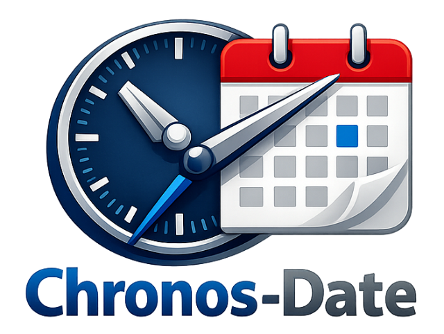

# Chronos Date

A lightweight, immutable, and plugin-based date-time manipulation library for JavaScript and TypeScript.



## Why Chronos?

In ancient Greek mythology, **Chronos** is the primordial embodiment of time — not merely tracking moments, but **defining their very existence**. Like its mythological namesake, the `Chronos` class offers **precise, immutable, and expressive control** over time within your application.

Designed to go beyond the native `Date` object, it empowers you to manipulate, format, compare, and traverse time with **clarity, reliability, and confidence** — all while staying _immutable_ and _framework-agnostic_.

## Key Features

- **Immutability:** Every modification returns a new `Chronos` instance. Your original dates remain intact.
- **Rich API:** From formatting to comparison, calculation, and detailed part extraction.
- **Time Zone Support:** Advanced formatting and tracking of UTC offsets and Native time zone properties.
- **Plugin System:** Extend core capabilities seamlessly using `Chronos.use(plugin)`. Over a dozen official plugins exist for advanced operations like business hours, seasons, zodiacs, relative times, and localization.
- **Comprehensive TypeScript IntelliSense:** Built with first-class TypeScript types, including granular tracking for strict date formatting tokens.
- **Cross-environment compatibility:** Works anywhere JS runs (Node.js, Browser, Deno, Bun).

## Installation

```sh
npm install chronos-date
# or
yarn add chronos-date
# or
pnpm add chronos-date
```

## Quick Start

```ts
import { Chronos, chronos } from 'chronos-date';

// Using the constructor
const now = new Chronos();
console.log(now.format('dd, mmm DD, YYYY')); 

// Using the function wrapper
const tomorrow = chronos().addDays(1);
console.log(tomorrow.formatStrict('YYYY-MM-DD'));

// Calculate differences
const eventDate = new Chronos('2025-12-31');
console.log(now.diff(eventDate, 'day')); // Days until event
```

## Documentation

For full documentation, API reference, and interactive playgrounds, visit the [Documentation Site](https://toolbox.nazmul-nhb.dev/docs/classes/chronos).

## License

This project is licensed under the [Apache License 2.0](LICENSE).
